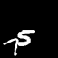
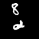

# CMS-LSTM: Context-Embedding and Multi-Scale Spatiotemporal-Expression LSTM for Video Prediction

## Abstract
Spatiotemporal predictive learning (ST-PL) is a hotspot with numerous applications, such as object movement and meteorological prediction. It aims at predicting the subsequent frames via observed sequences. However, inherent uncertainty among consecutive frames exacerbates the difficulty in long-term prediction. To tackle the increasing ambiguity during forecasting, we design CMS-LSTM to focus on context correlations and multi-scale spatiotemporal flow with details on fine-grained locals, containing two elaborate designed blocks: Context Embedding (CE) and Spatiotemporal Expression (SE) blocks. CE is designed for abundant context interactions, while SE focuses on multi-scale spatiotemporal expression in hidden states. The newly introduced blocks also facilitate other spatiotemporal models (e.g., PredRNN, SA-ConvLSTM) to produce representative implicit features for ST-PL and improve prediction quality. Qualitative and quantitative experiments demonstrate the effectiveness and flexibility of our proposed method. With fewer params, CMS-LSTM outperforms state-of-the-art methods in numbers of metrics on two representative benchmarks and scenarios. Code is available at [https://github.com/czh-98/CMS-LSTM](https://github.com/czh-98/CMS-LSTM).

## Results

<div>
    <table width="600" border="0px">
      <tr>
        <th width="100">(Real)</th>
        <th width="100">Ours</th>
        <th width="100">PredRNN</th>
        <th width="100">PredRNN++</th>
        <th width="100">MIM</th>
        <th width="100">SA-LSTM</th>
      </tr>
    </table>
    
    
    
    
    
    
</div>
<div>
    
    
    
    
    
    
</div>


## Datasets
<!-- ## Pre-trained Models and Datasets -->
<!-- Pretrained Model will be released soon! -->
Moving MNIST dataset is avilliable at [here](https://drive.google.com/drive/folders/1Dl0WcevBRSsLn6KYJ7-zxMjLqo1S7WVr?usp=sharing):

## Setup
All code is developed and tested on a Nvidia RTX2080Ti the following environment.
- Ubuntu18.04.1
- CUDA 10.0
- cuDNN 7.6.4
- Python 3.8.5
- h5py 2.10.0
- imageio 2.9.0
- numpy 1.19.4
- opencv-python 4.4.0.46
- pandas 1.1.5
- pillow 8.0.1
- scikit-image 0.17.2
- scipy 1.5.4
- torch 1.7.1
- torchvision 0.8.2
- tqdm 4.51.0
## Code Architecture
```
CMS-LSTM.
│  README.md
│  test.py
│  train.py
│  utils.py
│
├─data
│  └─ movingmnist.py
│
├─logs
├─models
│  │  basic_blocks.py
│  │  CMSLSTM.py
│  └─ __init__.py
│
│
├─scripts
│  └─ train_mmnist.sh
│      
│
└─trainers
   │  frame_prediction_trainer.py
   └─ __init__.py

```

## Train
### Train in Moving MNIST
Use the `scripts/train_mmnist.sh` script to train the model. To train the default model on Moving MNIST simply use:
```shell
cd scripts
sh train_mmnist.sh
```
You might want to change the `--data_root` which point to paths on your system of the data.

```
CUDA_VISIBLE_DEVICES=0 \
python train.py \
--model 'cmslstm' \
--dataset 'mmnist' \
--data_root './data/Moving_MNIST' \
--lr 0.001 \
--batch_size 8 \
--epoch_size 200 \
--input_nc 1 \
--output_nc 1 \
--load_size 720 \
--image_width 64 \
--image_height 64 \
--patch_size 4 \
--rnn_size 64 \
--rnn_nlayer 4 \
--filter_size 3 \
--seq_len 10 \
--pre_len 10 \
--eval_len 10 \
--criterion 'MSE' \
--lr_policy 'cosine' \
--niter 5 \
--total_epoch 2000 \
--data_threads 4 \
--optimizer adamw
```


## BibTeX
If you find this repository useful in your research, please consider citing the following paper:
```
@article{chai2021cms,
  author = {Chai, Zenghao and Xu, Zhengzhuo and Bai, Yunpeng and Lin, Zhihui and Yuan, Chun},
  title = {CMS-LSTM: Context Embedding and Multi-Scale Spatiotemporal Expression LSTM for Predictive Learning},
  journal = {arXiv preprint arXiv:2102.03586},
  year = {2021}
}
```


## Questions
If you have any questions or problems regarding the code or paper do not hesitate to contact us.